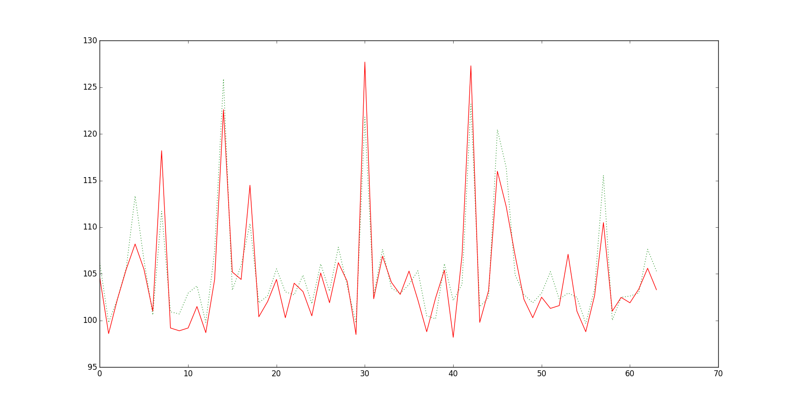

# 1. 股票基础知识

&emsp; [网盘链接](http://pan.baidu.com/s/1nv7asPV) ， 密码：`uxjv`

# 2. 使用python获取股票数据

+ tushare是国人做的python爬虫库，可以获取股票、期货、宏观经济等数据.  
  [tushare官网](http://tushare.waditu.com/)  
  [python使用tushare库获取股票历史数据](https://zhuanlan.zhihu.com/p/23154693)  
  [python使用requests库获取股票实时价格](https://zhuanlan.zhihu.com/p/24446580)  
  [python分析股票__知乎](https://www.zhihu.com/question/52887249)  
  [tushare_github](https://github.com/waditu/tushare)  

+ install tushare  
```python
    pip install lxml
    pip install pandas
    pip install matplotlib
    pip install tushare
```

+ demo for tushare:  
```python
import tushare as ts
ts.get_hist_data('600848')
ts.get_hist_data('600848',start='2015-01-05',end='2015-01-09')

ts.get_hist_data('600848', ktype='W') #获取周k线数据
ts.get_hist_data('600848', ktype='M') #获取月k线数据
ts.get_hist_data('600848', ktype='5') #获取5分钟k线数据
ts.get_hist_data('600848', ktype='15') #获取15分钟k线数据
ts.get_hist_data('600848', ktype='30') #获取30分钟k线数据
ts.get_hist_data('600848', ktype='60') #获取60分钟k线数据
ts.get_hist_data('sh'）#获取上证指数k线数据，其它参数与个股一致，下同
ts.get_hist_data('sz'）#获取深圳成指k线数据
ts.get_hist_data('hs300'）#获取沪深300指数k线数据
ts.get_hist_data('sz50'）#获取上证50指数k线数据
ts.get_hist_data('zxb'）#获取中小板指数k线数据
ts.get_hist_data('cyb'）#获取创业板指数k线数据

#2.获取基本面数据
通过tushare我们还可以通过ts.get_stock_basics()获取基本面数据（返回结果部分展示）：
ts.get_stock_basics()

#3.宏观数据
我们以居民消费指数为例，可以通过ts.get_cpi()函数获取（一次会获取322条，部分展示）：
print ts.get_cpi()
```


# 3 深度学习模型预测股市  
**keras**是一个基于python及theano的深度学习框架，人气比较旺，文档很全。提供较为上层的框架，搞个深度学习的原型非常方便。

## 3.1. keras环境搭建

  python的库一般对mac和linux比较友好，安装比较容易。不赘述。

+ windows下安装：  
  1)并不需要安装anaconda，仅用pip就可以。用pip安装wheel、scipy。  
  2)pip install keras。或者这几个库都在 [python package](http://www.lfd.uci.edu/~gohlke/pythonlibs/#ndimage) 中下载、安装。  
  3)安装的keras默认的backend是Tensorflow，但是由于TensorFlow在windows上支持不好（目前仅支持python3.5-64bit），所以我们将keras的backend设置为theano，需要修改 ` C:\用户\Administrator\.keras\kras.json ` ：  

```
{
    "image_dim_ordering": "th", 
    "epsilon": 1e-07, 
    "floatx": "float32", 
    "backend": "theano"
}
```


## 3.2. keras入门

参考  [深度学习框架Keras简介](http://www.open-open.com/lib/view/open1430982565991.html)


## 3.3. 使用keras中的LSTM做时间序列预测

参考博客 [LSTM时间序列预测](http://www.jianshu.com/p/fbd6d3c1dc21)

[LSTM预测股票最高价](http://blog.csdn.net/mylove0414/article/details/56969181)




